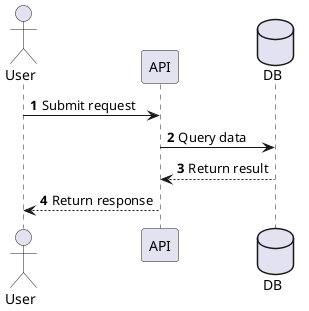
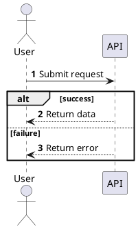
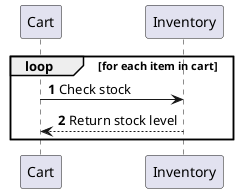
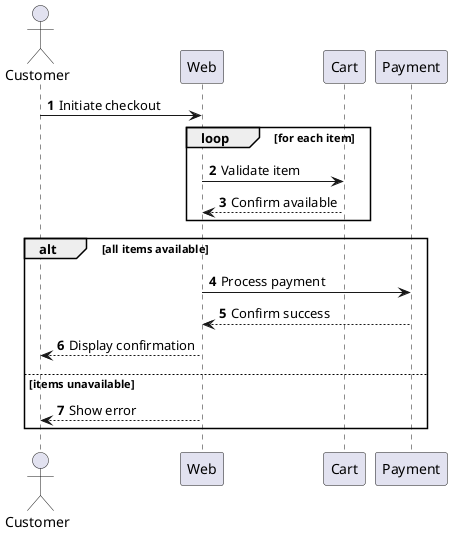

# Sequence Diagram (PlantUML)

## Basic Template

## Participant Types

| Type | Syntax | Use For |
|------|--------|---------|
| Actor | `actor User` | Human |
| Participant | `participant "Name" as Alias` | Component |
| Database | `database DB` | Database |
| Queue | `queue MQ` | Message queue |

## Arrow Types

`->` Sync request | `-->` Sync response | `->>` Async | `-->>` Async response

## Alt Pattern

## Loop Pattern

## Combined Example

## BSA Rules

1. **Action names only** - Use "Query users" not SQL code
2. **No JSON payloads** - Use "Return user data" not JSON
3. **No explanatory notes** - Keep diagram clean
4. **Raw PlantUML only** - No markdown fences around @startuml
5. **System interactions only** - Show component/service interaction, not low-level code internals
6. **Bounded scope only** - Keep only participants needed for the requested flow

## What NOT to Include

- SQL statements, table DDL, or ORM calls
- JSON payload dumps, request bodies, or response samples
- Frontend pixel behavior or visual styling notes
- Internal helper functions that do not matter at system-interaction level
- Speculative retries, branches, or services not grounded in source context

## Self-Review Checklist

Trước khi output, verify:

- [ ] Participants match the requested scope and source context
- [ ] Participant count stays lean enough to read, usually 3-7 unless the source context truly needs more
- [ ] Messages describe interactions, not code snippets or payload dumps
- [ ] Alt/loop blocks are used only where they add real behavioral value
- [ ] SQL, JSON, and low-level algorithm detail are excluded
- [ ] Success, failure, or exception branches are represented where the source context requires them
- [ ] Output is raw PlantUML only

**Phát hiện vi phạm → tự sửa trước khi output.**
