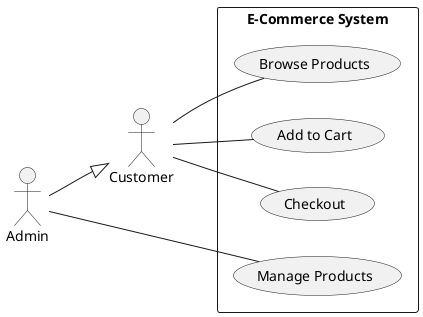
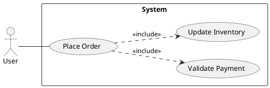
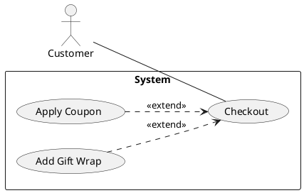
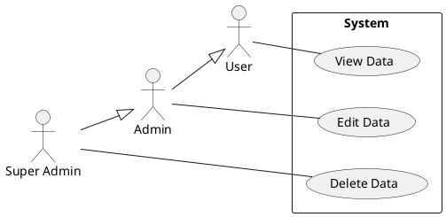

# Use Case Diagram (PlantUML)

Visualize user interactions with system using PlantUML syntax.

## Basic Elements

| Element | PlantUML | Description |
|---------|----------|-------------|
| Actor | `actor User` | User or external system |
| Use Case | `usecase "Login" as UC1` | System functionality |
| System | `rectangle System {}` | System boundary |
| Association | `User -- UC1` | Actor uses use case |
| Include | `UC1 ..> UC2 : <<include>>` | Required sub-function |
| Extend | `UC3 ..> UC1 : <<extend>>` | Optional extension |
| Generalization | `Admin --|> User` | Actor inheritance |

## Basic Template



## Include Relationship

Use when a use case **always** includes another use case.



## Extend Relationship

Use when a use case **optionally** extends another use case.



## Actor Generalization



## Best Practices

- **Naming**: Use verb phrases (e.g., "Place Order", not "Order")
- **Scope**: Keep 5-10 use cases per diagram
- **Actors**: Place primary actors on left, secondary on right
- **Direction**: Use `left to right direction` for horizontal layout
- **Boundaries**: Use `rectangle` to show system scope
- **Abstraction**: Keep actor-system goals at business level; do not leak DB tables, SQL, or API route details into the use case diagram

## Use Case Description Template

```
Use Case: [UC-ID] [Name]
Actor: [Primary actor]
Precondition: [What must be true before]
Postcondition: [What is true after]

Main Flow:
1. Actor [action]
2. System [response]
3. ...

Alternative Flow:
3a. [Condition]: System [alternative action]

Exception Flow:
2e. [Error]: System [error handling]
```

## Self-Review Checklist

Trước khi output, verify:

- [ ] Actor names are correct and grounded in source context
- [ ] Use case names are verb phrases, not module names or UI labels
- [ ] Diagram stays at actor-system interaction level
- [ ] No SQL, table names, payloads, or route-level detail leaked into the use case diagram
- [ ] Include/extend relationships are used intentionally, not as decoration
- [ ] Diagram scope matches the requested business capability

**Phát hiện vi phạm → tự sửa trước khi output.**
